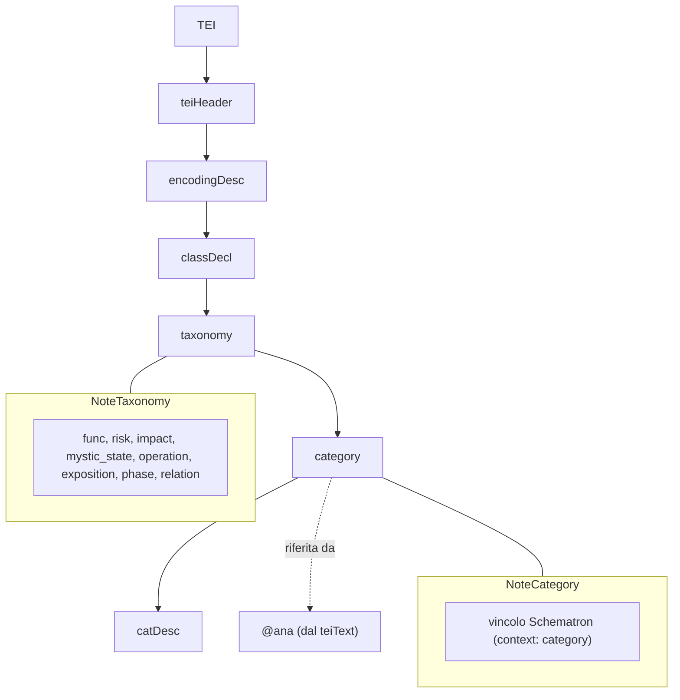

# Diagramma concettuale del governo tassonomico (TEI / RNG)

Il diagramma seguente rappresenta in forma schematica la struttura di governo
della tassonomia interpretativa in ambiente TEI.  
La visualizzazione ha **funzione esplicativa** e non sostituisce lo schema formale
di validazione (Relax NG e Schematron).

