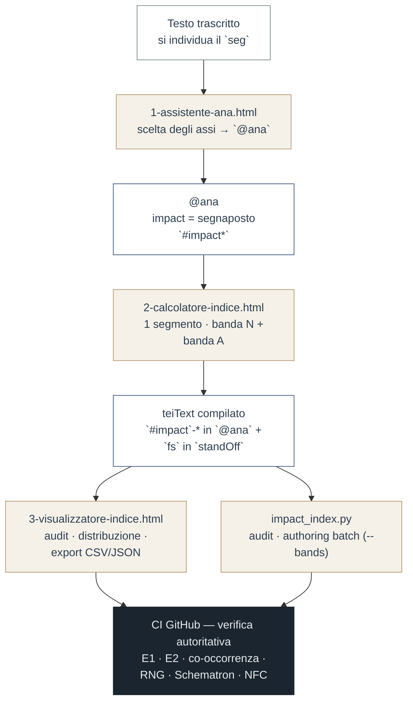

# tools/
## Intertestualità sotto sorveglianza
### *Modello TEI-driven e AI-assisted per l'analisi di citazioni, glosse e rimandi nel Castello dell'anima*

[](https://tei-c.org/) [](https://github.com/luciano-longo77/castello-anima-TEI-IA)

**Autrice**: Teresa di San Geronimo (Anna La Longa, 1670–post 1703)  
**Editor**: Luciano Longo  
**Licenza**: CC BY 4.0

Strumenti a supporto dell'edizione del *Castello dell'anima*: uno script a riga di comando e tre
strumenti visuali autonomi (pagine HTML, si aprono nel browser con doppio clic, **nessuna dipendenza esterna**).
Gli strumenti sono **aiuti** all'annotazione: la verifica autoritativa resta la **CI** (guardie E1/E2, co-occorrenza,
RelaxNG, Schematron, NFC).

## Il flusso



Confine metodologico: lo studioso decide gli **assi** interpretativi e le due **bande** N (necessità interpretativa) /A (riduzione dell'ambiguità); tutto il resto
(F (funzione prudenziale, letta da *operation*), I (indice), classe, `<fs>`) è prodotto **automaticamente** e in modo **deterministico**. Il valore I non si digita:
si calcola.

## Gli strumenti

| File | Tipo | Ruolo | Input → Output |
|---|---|---|---|
| `1-assistente-ana.html` | browser | compila `@ana` dagli assi della tassonomia | scelte per asse → `@ana` + `<seg>` |
| `2-calcolatore-indice.html` | browser | indice di **un** segmento, con guida alla griglia | banda N/A + operation → `I`, `#impact-*`, `<fs>` |
| `3-visualizzatore-indice.html` | browser | viewer read-only + audit + export | teiText compilato → tabella/distribuzione, CSV/JSON |
| `impact_index.py` | CLI | audit e authoring **batch** deterministico | teiText → report di coerenza e puntatori |

---

### `1-assistente-ana.html` — Assistente @ana

Individuato il `<seg>`, lo studioso sceglie per ogni **asse** la categoria dalla tassonomia (con descrizione a
fianco); lo strumento compone l'`@ana` con i prefissi corretti (l'asse `func` senza prefisso — `#legittimazione-…`,
`#ethos-…`, gli altri con prefisso) e genera il `<seg>`. L'asse `impact` resta il segnaposto **`#impact*`**, risolto
poi dal *Calcolatore*.

Include un pannello **Controlli** che replica in tempo reale le guardie della CI: **E2** (ogni token risolve alla
tassonomia), **co-occorrenza** (1 `#operation-*`, 1 fase base, `#phase-critical` sempre con una base), assenza di
duplicati, presenza di `impact`. Le categorie sono uno **snapshot** di **`tei/taxonomy/tassonomia-gh.xml`**.

### `2-calcolatore-indice.html` — Calcolatore indice d'impatto

Strumento a segmento singolo, da usare **mentre** si codifica. Si scelgono `operation` (dà F), **banda N** e
**banda A**; applica **`I = (4·F/3 + 2·N + A)/7`** e restituisce `I`, la classe `#impact-*` e la `<fs>` pronta da
incollare. Include la **Guida alla griglia** (rubriche N/A/F, ancore, soglie, esempi ancorati) sempre visibile a
fianco, l'aiuto contestuale sotto ogni menù e un'area appunti per la codifica. Il numero non si digita: si sceglie
la banda, l'ancora è determinata. Per generare le `<fs>` di **molti** segmenti in un colpo si usa
`impact_index.py --bands`.

### `3-visualizzatore-indice.html` — Visualizzatore indice d'impatto

Sola lettura. Apre un `teiText` compilato, legge le `<fs>`, **ricalcola I** dalle ancore e ne **verifica la
coerenza** con la classe `#impact-*` (segnala `DIVERGE` con il motivo), valida i puntatori, mostra la
**distribuzione** per classe e per F, ed **esporta CSV/JSON**. È l'anteprima browser di ciò che `impact_index.py`
e lo Schematron fanno in CI.

### `impact_index.py` — audit e authoring da riga di comando

Calcolo deterministico e audit dell'**indice d'impatto** (`I = (4·F/3 + 2·N + A)/7`, pesi AHP 4:2:1).
Modello **a bande‑ancora**: N ∈ {0.90, 0.75, 0.55, 0.30}, A ∈ {0.85, 0.675, 0.40};
F = rango dell'asse `operation` (delimitazione=1; attenuatio/precisatio/riequilibrio=2; declaratio=3).
Definizione e protocollo: `docs/indice-impatto.md`, `docs/Protocollo-indice-impatto.md`.

Richiede `python3` e `lxml` (`pip install lxml`).

> **Esempi pronti** in [`tools/esempi/`](esempi/): [`esempio-1-assistente.xml`](esempi/esempio-1-assistente.xml) (segmento grezzo) → [`esempio-2-calcolatore.xml`](esempi/esempio-2-calcolatore.xml) (`@ana` + `#impact*`) → [`esempio-3-visualizzatore.xml`](esempi/esempio-3-visualizzatore.xml) (teiText compilato, apribile nel Visualizzatore). Stesso segmento (`seg-III-tit`) nei tre stadi del flusso.

**Modalità**
- **audit** (default) — legge le `<fs>` presenti, ri‑mappa N/A alle bande, ricalcola I con le ancore e lo confronta
  con l'`#impact-*` dichiarato in `@ana`; valida i puntatori (`@corresp`/`@target` → `xml:id` esistenti; ogni
  `<seg>` con `#impact-*` ha la sua `<fs>`).
- **authoring batch** (`--bands`) — da una tabella `id;banda_N;banda_A` calcola I, banda e valori per molti
  segmenti in un colpo (l'equivalente da riga di comando del Calcolatore).

```bash
# audit dell'intero teiText
python3 tools/impact_index.py tei/text/castello-anima-teiText.xml

# audit + validazione schema (RelaxNG TEI All + Schematron dell'indice)
python3 tools/impact_index.py tei/text/castello-anima-teiText.xml \
        --rng schema/tei_all.rng --sch schema/impactindex.sch

# authoring batch da bande decise dallo studioso
python3 tools/impact_index.py tei/text/castello-anima-teiText.xml --bands bande.csv
```

```csv
# bande.csv — id;banda_N;banda_A
seg-c8-desiderio;critica;alta
```

## Verificabilità e falsificabilità

Gli strumenti **anticipano** i controlli che la CI poi **impone**:

| Livello | Dove | Controlli |
|---|---|---|
| Anteprima (mentre annoti) | strumenti visuali | `1-assistente-ana` → E2 + co-occorrenza; `2-calcolatore-indice` → formula espansa; `3-visualizzatore-indice` → audit `DIVERGE` |
| Verifica autoritativa (al commit) | workflow GitHub | E1, E2, co-occorrenza, RelaxNG `tei_all`, Schematron `impactindex.sch`, NFC |

Se un `@ana` supera i Controlli dell'Assistente, supera E2 e la co-occorrenza anche in pipeline; se una `<fs>` è
coerente nel Visualizzatore, lo è anche per lo Schematron. Gli strumenti non sostituiscono la CI: la **fonte di
verità** è il repository (tassonomia, schemi, guardie).

## Nota tecnica

Le pagine HTML sono **autonome** (nessuna libreria esterna, nessuna rete) e non vengono validate dalla CI: sono
strumenti d'ausilio, non dati del corpus (in `tools/**` non scatta alcun workflow). I dati tassonomici incorporati
negli strumenti sono uno **snapshot** di **`tei/taxonomy/tassonomia-gh.xml`** al momento della generazione.
